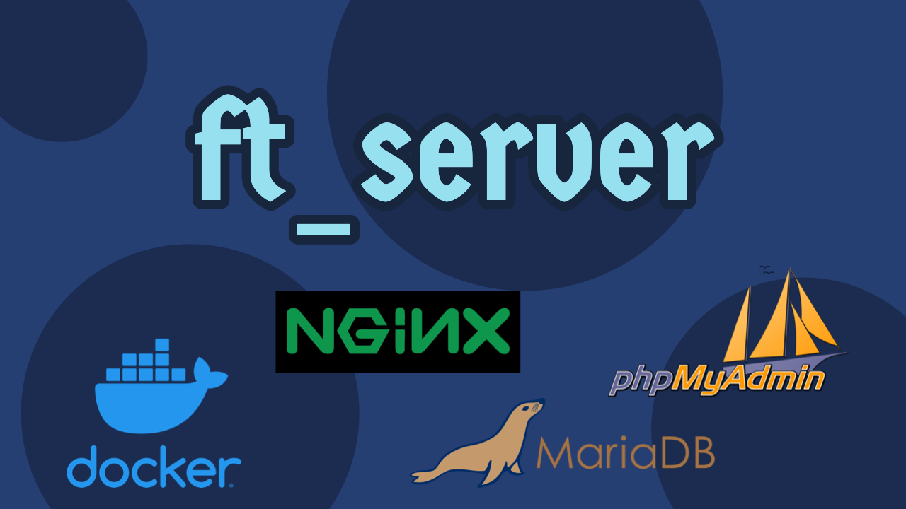
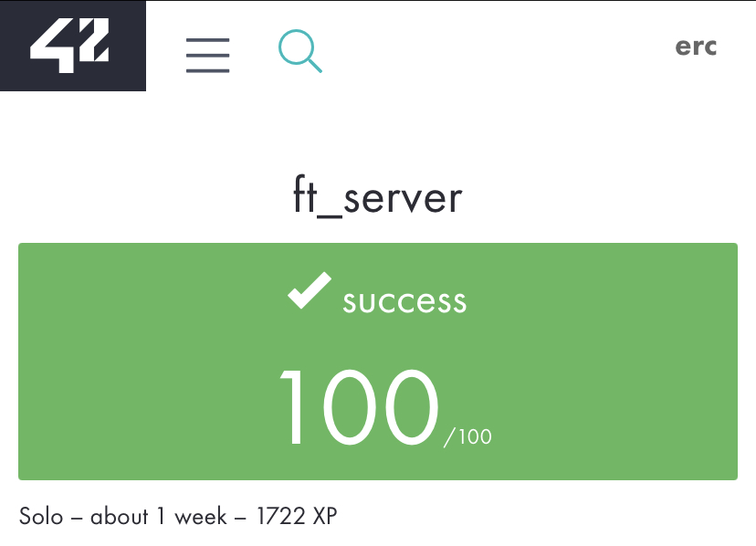

## :dart: Goal
* This topic is intended to introduce you to **system administration**.
* It will make you aware of the importance of using **scripts to automate** your tasks. 
* You will discover the **"docker"** technology and use it to install a complete **web server**.
* This server will run multiples services: Wordpress, phpMyAdmin, and a SQL database.
* **Read the pdf** [HERE](https://drive.google.com/file/d/1pWiiN57PzxxYz9okIGRBpHpr0bK1bX1h/view?usp=sharing)

## :wrench: Usage

```bash
# Build the image based on our Dockerfile
docker build -t [image name] [Dockerfile path]

# Create the container who execute a script on CMMD => setup_application.sh
docker run --name [container name] -it  -p 80:80 -p 443:443 [image name]

# Enter container's interactive mode
docker exec -it [container] /bin/bash

# Enable autoindex
docker exec -it [container] /bin/bash /tmp/autoindex/ai_on.sh

# Disable autoindex
docker exec -it [container] /bin/bash /tmp/autoindex/ai_off.sh

# Check old containers
docker ps -a

# Remove Containers
docker rm -f [container]
```

## :books: Resources
A rich, deep research to understand all the services used is vital. With Docker is even easier and faster to explore practically!
* Great starting place -  [LINK](https://harm-smits.github.io/42docs/projects/ft_server)
* Understand [Virtualization](https://www.youtube.com/watch?v=FZR0rG3HKIk) and [Containerization](https://www.youtube.com/watch?v=0qotVMX-J5s)
* Familiarize yourself with Docker enviroment - [LINK](https://docs.docker.com/get-started/)
* Explore LEMP stack implementation - [LINK](https://www.tecmint.com/install-lemp-on-debian-10-server/) | [LINK](https://www.digitalocean.com/community/tutorials/how-to-install-linux-nginx-mariadb-php-lemp-stack-on-debian-10) (there are differences in some commands from debian 9, 10, and buster)
* MariaDB vs MySQL - [LINK](https://www.guru99.com/mariadb-vs-mysql.html#:~:text=MariaDB%20has%20a%20larger%20connection,code%20in%20its%20Enterprise%20Edition.)
* Check your host ports - [LINK](https://unix.stackexchange.com/questions/244531/kill-process-running-on-port-80#:~:text=There%20are%20several%20ways%20to,associated%20with%20the%20listening%20port.&text=After%20finding%20out%2C%20you%20can,kill%20the%20process(es).&text=Replace%20echo%20by%20sudo%20for%20the%20process%20to%20actually%20be%20killed.)
* Install Wordpress along LEMP stack - [LINK](https://www.tecmint.com/install-wordpress-alongside-lamp-on-debian-10/)
* NGINX configuration - [LINK](https://www.linode.com/docs/web-servers/nginx/how-to-configure-nginx/)
* Generate SSL key - [LINK](https://linuxize.com/post/creating-a-self-signed-ssl-certificate/)
* SED command for autoindex - [LINK](https://www.youtube.com/watch?v=TFq5YxN7pE0)
### Repositories
* [rchallie](https://github.com/rchallie/ft_server)
* [edithturn](https://github.com/edithturn/42-ft-server)
* [khodizoda](https://github.com/khodizoda/42_ft_server)
* [michaelgiraldo](https://github.com/michaelgiraldo/ft_server)

## :heavy_check_mark: Moulinette



# **SOLI DEO GLORIA**
